# 🏗️ Robinhood HA Breakout - System Architecture

**Understanding How Your Multi-Symbol Trading Assistant Works**

*A non-technical guide to the system's design and components*

---

## 🎯 Overview: The Big Picture

Think of the Robinhood HA Breakout system like a **smart factory** that processes market information from multiple sources and produces prioritized trading recommendations. Here's how the "factory" works:

```
📊 Multi-Symbol Data → 🧠 AI Analysis → 🎯 Opportunity Ranking → 💰 Risk Check → 🌐 Browser Action → ✋ Your Decision
     (SPY, QQQ, IWM)      (Concurrent)        (Best First)         (Conservative)        (Manual Review)
```

**New in v0.9.0**: The system now operates like a **professional trading desk** with multi-broker support and enhanced intelligence:
- **🏦 Multi-Broker Support**: Alpaca paper/live trading alongside Robinhood automation
- **🔒 Environment Isolation**: Separate bankroll ledgers and trade logs per broker/environment
- **🛡️ Safety Interlocks**: Explicit live trading acknowledgment with automatic paper fallback
- **📊 Environment Tagging**: All Slack notifications tagged with [PAPER]/[LIVE]/[RH]
- **Enhanced LLM Decision Engine** with 4 professional-grade market analysis features
- **Context Memory System** that learns from recent trades and adapts strategy
- **Robust Data Infrastructure** with automatic fallback for 99.9% uptime
- **Concurrent scanning** of multiple symbols (SPY, QQQ, IWM)
- **Real-time data feeds** from professional sources (Alpaca → Yahoo fallback)
- **Intelligent prioritization** of the best opportunities
- **Enhanced monitoring** with automated position tracking
- **Mobile-first alerts** via Slack with rich charts

Each step has specific "workers" (software components) that handle different parts of the process, just like different departments in a company.

---

## 🏢 System Components (The "Departments")

### 1. 📈 **Data Department** (`utils/data.py` + `utils/alpaca_client.py`)
**What it does**: Collects and prepares market information with professional-grade data quality

**Think of it as**: Your research team with access to Wall Street-quality data feeds
- **Primary**: Real-time data from Alpaca Markets (professional-grade)
- **Fallback**: Yahoo Finance data (15-20 minute delays)
- Converts regular price charts to smoother "Heikin-Ashi" charts
- Finds important price levels (support and resistance)
- Packages everything into a neat report for the AI

**Key Functions**:
- `fetch_market_data()`: Downloads real-time stock prices (Alpaca → Yahoo fallback)
- `get_current_price()`: Gets real-time current price for analysis
- `calculate_heikin_ashi()`: Makes charts easier to read
- `analyze_breakout_pattern()`: Identifies trading opportunities

**Alpaca Integration** (`utils/alpaca_client.py`):
- `AlpacaClient()`: Professional market data client
- `get_current_price()`: Real-time stock quotes
- `get_market_data()`: Historical bars with minimal delay
- `get_option_estimate()`: Enhanced option price estimation
- `is_market_open()`: Real-time market status

### 2. 🎯 **Multi-Symbol Scanner** (`utils/multi_symbol_scanner.py`) **NEW!**
**What it does**: Coordinates concurrent analysis of multiple symbols and prioritizes opportunities

**Think of it as**: Your portfolio manager who watches multiple markets simultaneously
- **Concurrent Scanning**: Uses ThreadPoolExecutor to analyze SPY, QQQ, IWM simultaneously
- **Opportunity Prioritization**: Ranks trading signals by confidence and technical strength
- **Conservative Execution**: Only trades the single best opportunity per cycle
- **Risk Distribution**: Prevents over-leveraging across multiple positions

**Key Functions**:
- `scan_all_symbols()`: Coordinates multi-symbol analysis
- `_prioritize_opportunities()`: Ranks opportunities by quality
- `_calculate_priority_score()`: Scores based on confidence + technical factors
- `_send_multi_symbol_alert()`: Enhanced Slack notifications with opportunity ranking

### 3. 🧠 **Enhanced AI Department** (`utils/llm.py` + `utils/data.py`) **ENHANCED v2.2.0!**
**What it does**: Makes professional-grade trading decisions using enhanced artificial intelligence

**Think of it as**: Your institutional-quality analyst with Wall Street-level market intelligence
- **Enhanced Market Analysis**: 4 new professional-grade features for smarter decisions
- **Context Memory**: Learns from recent trades and adapts strategy
- **Robust Decision Making**: Multiple data sources with automatic fallback
- **Professional Intelligence**: Comparable to institutional trading desks

#### 🎯 **Enhanced LLM Features (NEW!)**

**1. 📊 VWAP Deviation Analysis** (`build_llm_features()`):
- **What**: Real-time deviation from 5-minute volume-weighted average price
- **Why**: Identifies institutional buying/selling pressure
- **How**: `((current_price - vwap) / vwap) * 100`
- **Insight**: Positive = bullish momentum, negative = bearish pressure

**2. 🎯 ATM Delta Calculation** (Black-Scholes):
- **What**: Option sensitivity to underlying price moves
- **Why**: Optimizes entry timing and risk/reward
- **How**: Black-Scholes formula for nearest-expiry ATM options
- **Insight**: Higher delta = better leverage for momentum trades

**3. 💧 ATM Open Interest Assessment**:
- **What**: Liquidity analysis for trade execution quality
- **Why**: Prevents poor fills on illiquid options
- **How**: Analyzes open interest for ATM strikes
- **Insight**: High OI (10,000+) = tight spreads, easy entry/exit

**4. 🏛️ Dealer Gamma Intelligence** (SpotGamma):
- **What**: Market maker positioning and hedging flows
- **Why**: Predicts volatility behavior and market dynamics
- **How**: Reads dealer gamma exposure from SpotGamma data
- **Insight**: Negative gamma = volatility amplification expected

#### 🧠 **Context Memory System** (`utils/recent_trades.py`):
- **Recent Trade Memory**: Remembers last 5 trades and outcomes
- **Adaptive Learning**: Adjusts strategy based on recent performance
- **Pattern Recognition**: Prevents repeating recent mistakes
- **Configurable Depth**: `MEMORY_DEPTH` setting in config.yaml

#### 🔄 **Robust Data Infrastructure**:
- **Primary Source**: Alpaca API for real-time professional data
- **Automatic Fallback**: Yahoo Finance backup on connection issues
- **Zero Downtime**: Seamless switching between data sources
- **Enhanced Reliability**: Comprehensive error handling and recovery

**Key Functions**:
- `make_trade_decision()`: Enhanced decision-making with all 4 features
- `build_llm_features()`: Calculates professional-grade market metrics
- `prepare_llm_payload()`: Comprehensive market context preparation
- `load_recent_trades()`: Context memory injection for adaptive learning

### 3. 🏦 **Multi-Broker Architecture** (`utils/alpaca_client.py` + `utils/scoped_files.py`) **NEW v0.9.0!**
**What it does**: Manages multiple trading brokers with complete environment isolation

**Think of it as**: Your multi-bank account manager with separate ledgers for each account
- **🏦 Alpaca Integration**: Paper and live trading with institutional-grade infrastructure
- **🤖 Robinhood Integration**: Browser automation with manual confirmation workflow
- **🔒 Environment Isolation**: Separate bankroll ledgers per broker/environment combination
- **🛡️ Safety Interlocks**: Explicit live trading acknowledgment with automatic paper fallback
- **📊 Environment Tagging**: All notifications tagged with [PAPER]/[LIVE]/[RH]

**Broker Support**:
- **Alpaca Paper**: Risk-free testing with $100,000 virtual account
- **Alpaca Live**: Real money trading with professional execution infrastructure  
- **Robinhood**: Browser automation with human oversight and manual confirmation

**File Isolation System**:
```
# Complete separation per broker/environment
bankroll_alpaca_paper.json     # Alpaca paper trading ledger
bankroll_alpaca_live.json      # Alpaca live trading ledger  
bankroll_robinhood_live.json   # Robinhood trading ledger

logs/trade_history_alpaca_paper.csv    # Paper trade history
logs/trade_history_alpaca_live.csv     # Live trade history
logs/trade_history_robinhood_live.csv  # Robinhood trade history

positions_alpaca_paper.csv     # Paper positions
positions_alpaca_live.csv      # Live positions
positions_robinhood_live.csv   # Robinhood positions
```

**Key Functions**:
- `AlpacaClient(env="paper"|"live")`: Environment-aware Alpaca client
- `get_scoped_bankroll_path()`: Returns broker/environment-specific ledger path
- `get_scoped_trade_history_path()`: Returns scoped trade history file path
- `ensure_scoped_files_exist()`: Creates scoped files with proper headers
- `migrate_legacy_files()`: Moves old files to scoped format

**Safety Features**:
- **Explicit Live Trading Flag**: `--i-understand-live-risk` required for live trading
- **Automatic Paper Fallback**: Defaults to paper trading if safety flag missing
- **Environment Validation**: Prevents accidental live trading without acknowledgment
- **Cross-Contamination Prevention**: No mixing of paper and live data

### 4. 💰 **Money Department** (`utils/bankroll.py`) **ENHANCED v0.9.0!**
**What it does**: Manages your money with broker/environment-aware ledger tracking

**Think of it as**: Your personal accountant with separate books for each trading account
- **🔒 Scoped Ledgers**: Separate bankroll files per broker/environment
- **📊 Environment Tracking**: Each ledger tagged with broker:environment ID
- **🔄 Backward Compatibility**: Existing files preserved and supported
- **💰 Risk Management**: Position sizing and capital protection per environment

**Enhanced Features**:
- **Scoped File Management**: `bankroll_{broker}_{env}.json` naming convention
- **Ledger ID System**: Returns "broker:env" identifier for tagging
- **Automatic Seeding**: New ledgers created with START_CAPITAL_DEFAULT
- **Environment Isolation**: No cross-contamination between environments

**Key Functions**:
- `BankrollManager(broker, env)`: Environment-aware bankroll management
- `ledger_id()`: Returns "alpaca:paper" or "robinhood:live" identifier
- `get_current_bankroll()`: Environment-specific capital tracking
- `calculate_position_size()`: Risk management per environment
- `update_bankroll()`: Records profits/losses to correct ledger

### 4. 🌐 **Automation Department** (`utils/browser.py`)
**What it does**: Controls your web browser to interact with Robinhood

**Think of it as**: Your personal assistant who handles the clicking
- Opens Chrome browser in "stealth mode"
- Logs into your Robinhood account
- Navigates to the options trading page
- Fills out trade forms automatically
- **Stops before submitting** - you make the final decision

**Key Functions**:
- `login()`: Signs into Robinhood
- `navigate_to_options()`: Goes to the trading page
- `find_atm_option()`: Finds the right option to trade
- `click_option_and_buy()`: Fills out the trade form

### 5. 📱 **Communication Department** (`utils/slack.py` + Enhanced Integration) **UPGRADED!**
**What it does**: Sends you rich, mobile-optimized notifications with charts and analysis

**Think of it as**: Your professional trading desk that sends you Wall Street-quality alerts
- **Rich Slack Alerts**: Charts, technical analysis, and mobile-friendly formatting
- **Multi-Symbol Notifications**: Consolidated alerts showing all opportunities found
- **Position Monitoring**: Real-time P&L alerts with profit/loss thresholds
- **Chart Generation**: Automatic chart creation for breakout analysis
- **Heartbeat System**: Regular "still alive" messages during quiet periods

**Enhanced Components**:
- `utils/enhanced_slack.py`: Rich message formatting with charts
- `utils/slack_charts.py`: Professional chart generation for mobile viewing
- **Mobile-Optimized**: All alerts designed for phone/tablet viewing
- **Chart Attachments**: Automatic breakout charts attached to trade alerts

**Key Functions**:
- `send_trade_decision()`: "Found a trade opportunity!" (with charts)
- `send_multi_symbol_alert()`: "Scanned 3 symbols, found 2 opportunities"
- `send_breakout_alert_with_chart()`: Trade alert + technical analysis chart
- `send_heartbeat()`: "Still watching the market, no trades yet"
- `send_position_alert()`: "Your SPY position is up 15% - consider selling!"
- `send_error_alert()`: "Something went wrong, check the logs"

### 6. 📊 **Portfolio Department** (`utils/portfolio.py`)
**What it does**: Tracks your open positions and manages closing trades

**Think of it as**: Your position manager
- Keeps track of what options you currently own
- Decides whether new trades should open or close positions
- Calculates profits and losses when you close trades

### 7. 🔄 **Position Monitoring** (`monitor_alpaca.py`) **NEW!**
**What it does**: Automated real-time position tracking with profit/loss alerts

**Think of it as**: Your dedicated position manager watching your trades 24/7
- **Real-time P&L tracking** using Alpaca professional market data
- **Multi-level profit alerts** at 5%, 10%, 15%, 20%, 25%, 30% gains
- **Stop-loss protection** alerts at 25% loss threshold
- **End-of-day warnings** to close positions by 3:45 PM ET
- **Mobile Slack notifications** for all alerts
- **1-minute monitoring intervals** for maximum responsiveness
- **Advanced Exit Strategies**: Trailing stops and time-based exits

**Key Functions**:
- `EnhancedPositionMonitor()`: Main monitoring class with Alpaca integration
- `check_positions()`: Real-time P&L calculation and alert logic
- `check_profit_targets()`: Multi-level profit threshold monitoring
- `check_stop_loss()`: Automated loss protection alerts
- `check_end_of_day_warning()`: Time-based exit warnings

### 8. 📊 **Analytics Department** (`analytics_dashboard.py`) **NEW!**
**What it does**: Comprehensive trading performance analysis and reporting

**Think of it as**: Your personal trading performance analyst
- **Win/Loss Analysis**: Detailed breakdown of trading success rates
- **P&L Tracking**: Profit and loss analysis with trend identification
- **Risk Metrics**: Drawdown analysis and Sharpe ratio calculations
- **Export Capabilities**: HTML and CSV report generation
- **Slack Integration**: Automated performance summaries
- **Data Recovery**: Robust CSV parsing with corruption repair

**Key Functions**:
- `TradingAnalytics()`: Main analytics engine
- `calculate_performance_metrics()`: Win rate, P&L, drawdown analysis
- `generate_performance_report()`: Comprehensive HTML/CSV reports
- `send_slack_summary()`: Automated performance notifications
- `_repair_csv_file()`: Automatic trade log corruption repair

### 9. 🧠 **Enhanced LLM Integration** (`utils/multi_symbol_scanner.py`) **NEW!**
**What it does**: Bulletproof AI-powered trade decision making with advanced error recovery

**Think of it as**: Your resilient AI trading advisor that never fails
- **Robust Error Recovery**: Automatic retry logic with exponential backoff for API failures
- **Rate Limit Protection**: Smart delays and progressive wait times to prevent API throttling
- **Context Isolation**: Fresh AI analysis for each symbol to prevent cross-contamination
- **Standardized Data Pipeline**: Consistent market data structure ensures reliable AI decisions
- **Batch Analysis Framework**: Optional batching for multiple symbols to reduce API costs
- **Graceful Degradation**: Falls back to safe NO_TRADE decisions on persistent failures

**Key Functions**:
- `_robust_llm_decision()`: Retry logic with exponential backoff and rate limit handling
- `_prepare_market_data()`: Standardized data structure for consistent LLM payloads
- `_should_use_batch_analysis()`: Intelligent batching decision for cost optimization
- `_create_batch_analysis_prompt()`: Multi-symbol batch analysis prompt generation
- `_individual_analysis()`: Fallback to individual symbol analysis for safety

**Reliability Features**:
- **2-4 second progressive delays** between retry attempts
- **Up to 30-second waits** for rate limit recovery
- **Fresh LLMClient instances** per symbol for context isolation
- **10-candle context** (vs 5) for improved analysis quality
- **Timestamp tracking** for data freshness validation

### 10. 🛡️ **Exit Strategies** (`utils/exit_strategies.py`) **NEW!**
**What it does**: Advanced position exit logic with trailing stops and time-based exits

**Think of it as**: Your risk management specialist
- **Trailing Stop Logic**: Percentage-based profit protection
- **Time-Based Exits**: Automatic close recommendations before market close
- **Configurable Thresholds**: Customizable profit targets and stop losses
- **Integration Ready**: Works with position monitoring and Slack alerts

**Key Functions**:
- `ExitStrategyManager()`: Main exit strategy coordinator
- `check_exit_conditions()`: Evaluates all exit criteria
- `_check_trailing_stop()`: Trailing stop loss logic
- `_check_time_based_exit()`: End-of-day exit recommendations

### 10. 📈 **Position Monitoring Department** (`monitor_alpaca.py`)
**What it does**: Real-time position tracking with automated profit/loss alerts

**Think of it as**: Your dedicated position watchdog with professional-grade data
- **Real-time P&L tracking** using Alpaca professional market data
- **Multi-level profit alerts** at 5%, 10%, 15%, 20%, 25%, 30% gains
- **Stop-loss protection** alerts at 25% loss threshold
- **End-of-day warnings** to close positions by 3:45 PM ET
- **Mobile Slack notifications** for all alerts
- **1-minute monitoring intervals** for maximum responsiveness

**Key Functions**:
- `EnhancedPositionMonitor()`: Main monitoring class with Alpaca integration
- `get_current_price()`: Real-time stock price (Alpaca → Yahoo fallback)
- `estimate_option_price()`: Professional option price estimation
- `check_position_alerts()`: Multi-level profit/loss alert logic
- `send_profit_alert()`: Mobile notifications for profit targets
- `send_stop_loss_alert()`: Mobile notifications for stop losses
- `send_end_of_day_warning()`: Risk management alerts

**Usage**:
```bash
# Enhanced monitoring with real-time data
python monitor_alpaca.py

# Integrated monitoring mode
python main.py --monitor-positions
```

### 8. 📈 **Analytics Department** (`trading_dashboard.py`, `trade_history.py`)
**What it does**: Comprehensive trading performance analysis and reporting

**Think of it as**: Your personal trading analyst and accountant
- **Complete financial overview** (bankroll, P&L, win rate)
- **Trade history analysis** with detailed statistics
- **Risk metrics** and performance tracking
- **Manual vs automated trade comparison**
- **Tax reporting** and audit trail

**Key Scripts**:
- `trading_dashboard.py`: Comprehensive financial dashboard
- `trade_history.py`: Detailed trade analysis and statistics

**Usage**:
```bash
# View comprehensive trading dashboard
python trading_dashboard.py

# Analyze trade history and performance
python trade_history.py
```

---

## 🔄 How Everything Works Together

### Complete System Architecture (v1.0.0 - Production Ready)

```mermaid
graph TD
    %% Initialization Phase
    A[🚀 System Start] --> B[📋 Load Config & Environment]
    B --> C[🔌 Initialize Alpaca Client]
    C --> D[📱 Initialize Enhanced Slack Integration]
    D --> E[💰 Load Scoped Bankroll & Portfolio]
    E --> F{Broker Selection}
    F -->|Robinhood| G1[🌐 Start Chrome Browser Session]
    F -->|Alpaca| G2[🎯 Initialize AlpacaOptionsTrader]
    
    %% Main Trading Loop
    G1 --> H[📊 Data Dept: Fetch Multi-Symbol Data]
    G2 --> H
    H --> I[📊 Alpaca: Real-time Market Data]
    I --> J[📊 Yahoo Finance: Backup Data Source]
    J --> K[🔍 Calculate Heikin-Ashi Candles]
    K --> L[🔍 Data Analysis: Technical Indicators]
    L --> M[📈 Enhanced Features: VWAP, Delta, OI, Gamma]
    M --> N[🧠 Context Memory: Load Recent 5 Trades]
    
    %% Ensemble AI Decision Engine
    N --> O[🤖 AI Ensemble Decision Engine]
    O --> P[🧠 GPT-4o-mini Analysis]
    O --> Q[🧠 DeepSeek-V2 Analysis]
    P --> R[🗳️ Majority Vote Logic]
    Q --> R
    R --> S{Both Models Agree?}
    S -->|Yes| T[✅ Consensus Decision]
    S -->|No| U[🎯 Tie-Break: Higher Confidence Wins]
    U --> T
    
    %% Decision Processing
    T --> V{Trade Signal?}
    V -->|NO_TRADE| W[📱 S2: Throttled Heartbeat Check]
    W --> X{Send Heartbeat?}
    X -->|Yes| Y[📱 Slack: ⏳ Cycle N · SPY $XXX · NO_TRADE]
    X -->|No| Z[⏸️ Silent Cycle]
    Y --> AA[⏰ Wait for Next Interval]
    Z --> AA
    
    %% Multi-Broker Trade Execution Path
    V -->|CALL/PUT| BB[💰 Finance: Risk & Position Size Check]
    BB --> CC{Broker Route}
    
    %% Robinhood Path
    CC -->|Robinhood| DD[🌐 Browser: Navigate to Options Chain]
    DD --> EE[🔍 Find ATM Option]
    EE --> FF[📝 Pre-fill Order Form]
    FF --> GG[🛑 Stop at Review Screen]
    GG --> HH[📱 Slack: Rich Trade Alert with Charts]
    HH --> II[👤 User Decision: Submit/Cancel]
    
    %% Alpaca Path (NEW!)
    CC -->|Alpaca| JJ[🎯 Market Hours & Time Validation]
    JJ --> KK[🔍 Find ATM Contract via Alpaca API]
    KK --> LL[💰 Calculate 100× Options Position Size]
    LL --> MM[📋 Create MarketOrderRequest]
    MM --> NN[👤 Manual Approval Required]
    NN --> OO{User Approval?}
    OO -->|Approved| PP[🚀 Submit Order to Alpaca]
    OO -->|Rejected| QQ[❌ Cancel Order]
    PP --> RR[⏱️ Poll for Fill Status 90s]
    RR --> SS[📱 Slack: ALPACA Fill Confirmation]
    
    %% Trade Confirmation Workflow
    II --> TT{User Choice?}
    TT -->|Submit| UU[✅ Record Trade with Actual Fill Price]
    TT -->|Cancel| VV[❌ Record Cancelled Trade]
    QQ --> VV
    SS --> UU
    UU --> WW[📱 S3: Fill-Price Echo to Slack]
    VV --> XX[📱 Slack: Trade Cancelled Notification]
    WW --> YY[🟢 S1: Auto-Start Position Monitor]
    XX --> AA
    YY --> ZZ[📊 Monitor: Real-time P&L Tracking]
    ZZ --> AA
    
    %% Loop Control
    AA --> AAA{End Time Reached?}
    AAA -->|No| BBB[📊 Increment Cycle Counter]
    BBB --> H
    AAA -->|Yes| CCC[📱 S4: Generate Daily Summary]
    CCC --> DDD[📱 Slack: 📊 Daily Wrap-Up Block]
    DDD --> EEE[🟢 S1: Kill All Monitors with Breadcrumbs]
    EEE --> FFF[🧹 Cleanup: Close Browser & Resources]
    FFF --> GGG[🏁 System Exit]
    
    %% Error Handling
    H -.->|API Failure| HHH[🔄 Fallback to Yahoo Finance]
    HHH --> L
    P -.->|GPT Failure| III[🔄 Single Model Fallback]
    Q -.->|DeepSeek Failure| III
    III --> T
    RR -.->|Fill Timeout| JJJ[⚠️ Partial Fill Handling]
    JJJ --> SS
    
    %% Styling
    classDef slackUX fill:#e1f5fe,stroke:#01579b,stroke-width:3px
    classDef aiEngine fill:#f3e5f5,stroke:#4a148c,stroke-width:3px
    classDef dataFlow fill:#e8f5e8,stroke:#1b5e20,stroke-width:3px
    classDef userAction fill:#fff3e0,stroke:#e65100,stroke-width:3px
    classDef alpacaNew fill:#fff8e1,stroke:#f57f17,stroke-width:4px
    
    class Y,XX,WW,CCC,DDD slackUX
    class N,O,P,Q,S aiEngine
    class H,I,J,K,L dataFlow
    class HH,II,NN,OO userAction
    class G2,JJ,KK,LL,MM,PP,RR,SS alpacaNew
```



### Key System Components Integration

#### 🎯 **Multi-Broker Trading Engine (NEW v1.0.0)**
- **Robinhood Path**: Traditional browser automation with manual review screen
- **Alpaca Path**: Direct API options trading with real-time contract discovery
- **Environment Isolation**: Separate ledgers for paper/live trading environments
- **Safety Interlocks**: Live trading requires explicit `--i-understand-live-risk` flag
- **Scoped File System**: Broker/environment-specific bankroll and position tracking

#### 🔗 **Alpaca Options Trading Integration (NEW)**
- **Real-Time Contract Discovery**: Live options quotes via OptionHistoricalDataClient
- **ATM Contract Selection**: Liquid options with OI ≥1K, volume ≥100, max 15% spreads
- **Smart Expiry Logic**: 0DTE during 10:00-15:15 ET, weekly contracts otherwise
- **Market Hours Protection**: Blocks new entries after 15:15 ET cutoff
- **100× Risk Sizing**: Proper options multiplier for accurate position calculations
- **Fill Polling**: 90-second real-time order status with partial fill handling
- **Environment Tagging**: All Slack notifications tagged [ALPACA:PAPER]/[ALPACA:LIVE]

#### 🤖 **Ensemble AI Decision Engine**
- **Dual Model Analysis**: Both GPT-4o-mini and DeepSeek-V2 analyze identical market data
- **Majority Voting**: Models vote independently on {CALL, PUT, NO_TRADE}
- **Intelligent Tie-Breaking**: Higher confidence model wins when decisions differ
- **Robust Fallback**: Single-model operation if one provider fails

#### 📱 **Slack UX Integration (v0.7.0)**
- **S1 Breadcrumbs**: 🟢 Monitor started/stopped notifications
- **S2 Heartbeat**: ⏳ Throttled "still alive" messages during NO_TRADE cycles
- **S3 Fill Echo**: ✅ Immediate trade confirmation with actual fill prices
- **S4 Daily Summary**: 📊 End-of-day wrap-up with comprehensive statistics

#### 📊 **Enhanced Data Pipeline**
- **Primary**: Alpaca API for real-time market data
- **Fallback**: Yahoo Finance for reliability
- **Features**: VWAP deviation, ATM delta, open interest, dealer gamma
- **Context**: Recent 5-trade memory for adaptive learning

#### 🔄 **Position Monitoring Ecosystem**
- **Auto-Launch**: Monitors start automatically after trade submission
- **Real-Time Tracking**: Continuous P&L monitoring with Alpaca data
- **Smart Alerts**: Profit target and stop-loss notifications
- **Graceful Shutdown**: Clean monitor termination with Slack breadcrumbs

---

## 🏗️ File Structure (The "Office Layout")

```
robinhood-ha-breakout/
├── 📋 main.py                    # The "CEO" - coordinates everything
├── 🎯 monitor_alpaca.py          # Enhanced position monitoring with Alpaca
├── 📊 trading_dashboard.py       # Comprehensive financial dashboard
├── 📈 trade_history.py           # Trade analysis and statistics
├── 🧪 test_alpaca.py            # Alpaca integration testing
├── ⚙️ config.yaml               # Settings and preferences
├── 🔐 .env                      # Your passwords and API keys (includes Alpaca keys)
├── 📊 trade_log.csv             # History of all trades
├── 💰 bankroll.json             # Your current money situation
├── 📋 positions.csv             # Current open positions
├── 
├── utils/                       # The "departments"
│   ├── 📈 data.py              # Data Department (with Alpaca integration)
│   ├── 🔌 alpaca_client.py     # Alpaca API client for real-time data
│   ├── 🧠 llm.py               # AI Department (Ensemble Engine)
│   ├── 🧠 llm_client.py        # LLM Client with dual-model support
│   ├── 💰 bankroll.py          # Finance Department
│   ├── 🌐 browser.py           # Automation Department
│   ├── 📱 enhanced_slack.py    # Enhanced Slack Integration (v0.7.0)
│   ├── 📱 slack_charts.py      # Slack Chart Generation
│   ├── 📊 portfolio.py         # Portfolio Department
│   ├── 🔧 trade_confirmation.py # Trade Confirmation Manager (S3)
│   ├── 🚀 monitor_launcher.py  # Monitor Lifecycle Manager (S1)
│   ├── 📊 exit_strategies.py   # Advanced Exit Strategy Engine
│   └── 📈 recent_trades.py     # Context Memory System
├── 
├── tests/                       # Quality control
├── logs/                        # System records and monitoring logs
└── 📚 docs/                     # Documentation
```

---

## 🔧 How the System Starts Up

### Initialization Sequence

1. **🏢 Setup Phase**
   - Loads your configuration settings
   - Validates your API keys and passwords
   - Sets up logging and file systems
   - Initializes all departments

2. **🔍 Mode Selection**
   - Checks if you want loop mode or single-shot mode
   - Sets up appropriate workflows
   - Configures timing and notifications

3. **🚀 Execution Phase**
   - Starts the chosen workflow
   - Coordinates between departments
   - Handles errors gracefully
   - Provides status updates

---

## 🔄 Data Flow (How Information Moves)

### Enhanced Market Data Pipeline (with Alpaca)

```
Alpaca (Real-time) → Professional Market Data → Heikin-Ashi Conversion → Pattern Analysis → AI Input
        ↓ (fallback)
Yahoo Finance (Delayed) → Backup Data Source
```

### Position Monitoring Pipeline

```
Alpaca Real-time Prices → Option Price Estimation → P&L Calculation → Alert Logic → Slack Notifications
```

### Decision Pipeline

```
Market Analysis → AI Processing → Confidence Check → Risk Validation → Trade Execution
```

### Notification Pipeline

```
System Events → Message Formatting → Slack API → Your Phone/Computer
```

---

## 🛡️ Safety Mechanisms

### Multiple Layers of Protection

1. **🚫 Hard Stops**
   - Never auto-submits trades
   - Always requires manual approval
   - Cannot bypass the review screen

2. **💰 Financial Safeguards**
   - Risk limits based on your capital
   - Position size calculations
   - Bankroll tracking and validation

3. **🧠 Intelligence Filters**
   - Confidence thresholds
   - Pattern validation
   - Market condition checks

4. **🔧 Technical Protections**
   - Error handling and recovery
   - Browser crash protection
   - API failure management

5. **📊 Transparency**
   - Complete audit trail
   - Detailed logging
   - Decision explanations

---

## ⚡ Performance Characteristics

### Speed and Efficiency

- **Market Analysis**: 2-5 seconds
- **AI Decision**: 3-10 seconds  
- **Browser Automation**: 15-30 seconds
- **Total Cycle Time**: 20-45 seconds

### Resource Usage

- **Memory**: 200-500 MB
- **CPU**: Low (mostly waiting)
- **Network**: Minimal (API calls only)
- **Storage**: <1 MB per day of logs

### Scalability

- **Single User**: Optimized for individual trading
- **Multiple Symbols**: Currently SPY only (expandable)
- **Concurrent Trades**: One at a time (by design)
- **Loop Frequency**: 1-60 minute intervals

---

## 🔌 External Dependencies

### Required Services

1. **🌐 Yahoo Finance**
   - Purpose: Market data source
   - Reliability: Very high
   - Cost: Free
   - Backup: None currently

2. **🤖 AI Services**
   - OpenAI GPT-4o-mini: $0.10-0.50/session
   - DeepSeek: $0.02-0.10/session
   - Reliability: High
   - Backup: Switch between providers

3. **🏦 Robinhood**
   - Purpose: Trade execution platform
   - Reliability: High during market hours
   - Cost: Free (commission-free trading)
   - Backup: Manual trading

4. **📱 Slack (Optional)**
   - Purpose: Notifications
   - Reliability: Very high
   - Cost: Free for basic use
   - Backup: Log files and console output

---

## 🔄 Error Handling Strategy

### Graceful Degradation

1. **🌐 Network Issues**
   - Retry with exponential backoff
   - Skip cycles if persistent
   - Log all failures

2. **🤖 AI Service Downtime**
   - Switch to backup provider
   - Skip decision if both fail
   - Continue monitoring

3. **🏦 Robinhood Problems**
   - Retry login attempts
   - Handle MFA timeouts
   - Graceful browser restart

4. **💻 System Errors**
   - Comprehensive logging
   - Safe state preservation
   - Clean shutdown procedures

---

## 🔮 Future Expansion Possibilities

### Potential Enhancements

1. **📊 Multiple Symbols**
   - Add QQQ, IWM, other ETFs
   - Symbol-specific strategies
   - Portfolio diversification

2. **⏰ Advanced Timing**
   - Market hours awareness
   - Economic calendar integration
   - Volatility-based intervals

3. **🧠 Enhanced AI**
   - Multiple model consensus
   - Custom training data
   - Sentiment analysis integration

4. **📱 Mobile App**
   - Native mobile interface
   - Push notifications
   - Remote control capabilities

---

## 🎓 Understanding the Technology

### For the Curious Non-Techie

**Python**: The programming language - think of it as the "English" the system speaks

**APIs**: Ways for different software to talk to each other - like phone numbers for computer programs

**WebDriver**: Software that controls web browsers automatically - like a robot that can click and type

**JSON/CSV**: File formats for storing data - like different types of filing cabinets

**Environment Variables**: Secure way to store passwords - like a locked safe for sensitive information

**Logging**: Keeping detailed records - like a security camera that records everything

---

## 🤝 System Reliability

### What Makes It Trustworthy

1. **🧪 Extensive Testing**
   - Automated test suites
   - Manual verification procedures
   - Edge case handling

2. **📊 Transparent Operations**
   - Every decision is logged
   - All calculations are shown
   - Complete audit trail

3. **🛡️ Conservative Design**
   - Fail-safe defaults
   - Multiple confirmation steps
   - Human oversight required

4. **🔄 Continuous Monitoring**
   - Health checks
   - Performance metrics
   - Error rate tracking

---

## 📞 Getting Help

### When Things Don't Work

1. **📋 Check the Logs**
   - Look in `logs/app.log`
   - Search for ERROR messages
   - Note timestamps of issues

2. **🧪 Test in Isolation**
   - Use `--dry-run` mode
   - Test individual components
   - Verify configuration

3. **🔍 Debug Mode**
   - Use `--log-level DEBUG`
   - Get detailed information
   - Trace execution flow

4. **📚 Consult Documentation**
   - README troubleshooting section
   - Configuration examples
   - Common issues guide

---

**Remember**: This system is designed to be your assistant, not your replacement. It handles the tedious work so you can focus on making good trading decisions. The architecture ensures you're always in control while benefiting from automation and AI insights.

*Understanding your tools makes you a better trader! 🎯*
